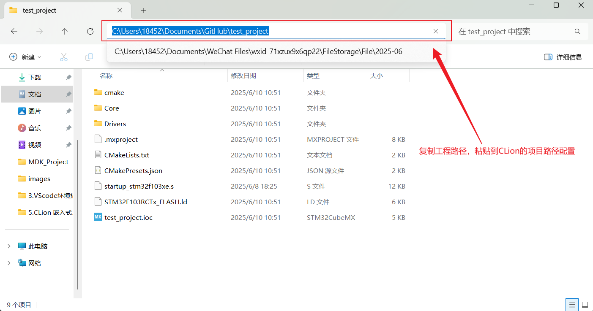
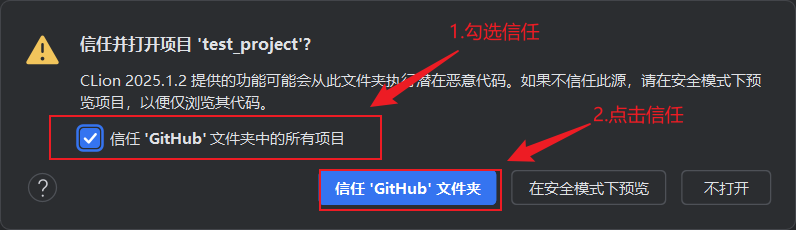
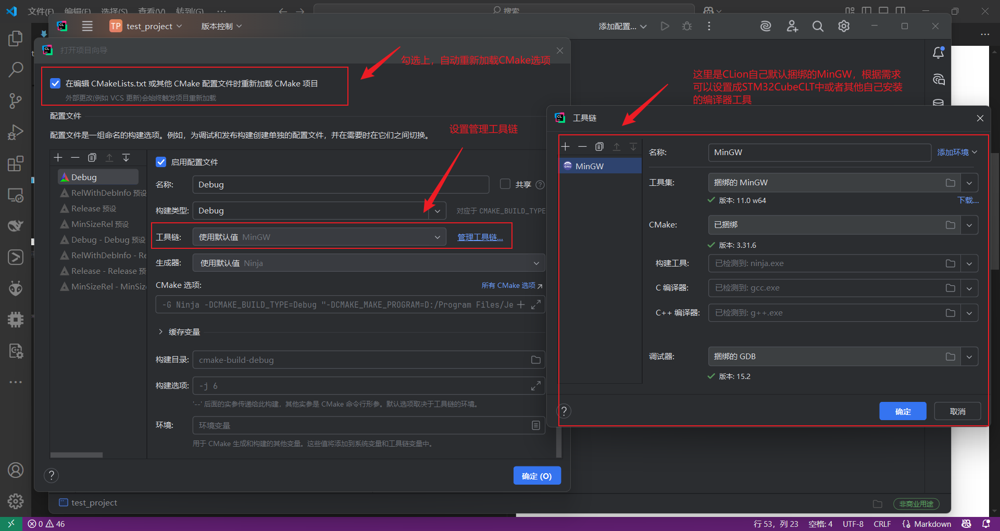
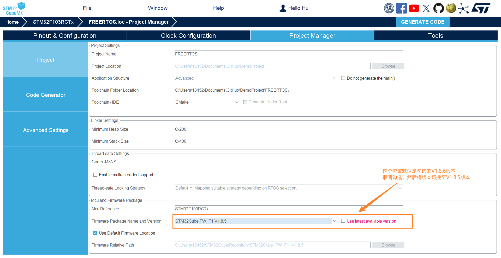

# 搭建Clion开发环境
## 下载FubeMX
1. 点击进入FubeMX界面，点击下载STM32CubeCTL安装包，该安装包安装后在文件夹下会包含ST官方打包的STM32开发工具链，包含ARM-GCC、CMake、Ninja等工具；

 

2. 点击进入Clion工作界面，点击"新建项目"，在左侧的选项栏中有针对嵌入式的STM32CubeMX选项，点击该选项，弹出配置页面；
注：这里Clion会自动检索CubeMX文件路径和CubeCTL编译器工具集路径，如果在安装STM32CubeMX和STM32CubeCTL时不是默认路径的话，需要自己手动修改路径！！！

## 下载OpenOCD
[OpenOCD下载链接](https://gnutoolchains.com/arm-eabi/openocd/ "OpenOCD下载链接")

# STM32CubeMX软件开发
## 生成代码
### 生成hal库代码
1. 点击"启动STM32CubeMX",开始进行芯片配置，然后生成Hal库代码文件
注：这里重点说明一下生成代码配置页的一些配置
- ==在配置生成代码页面，对生成环境设置为CMake，否则Clion对项目编译会报错== 

 

- ==粘贴代码路径，并将项目代码路径配置到CLion中== 

2. 配置完成，点击继续，会弹出"是否信任xx文件夹下的所有项目"以及“信任'xx'文件夹”,这里设置成全部信任

 

3. 配置默认工具链

- ==这里展示一下配置CubeCLT中的工具链==
(1)添加一个新的MinGW工具链，并修改其中的链接路径，都修改为CubeCLT中的工具链或者自己安装扩展的工具链

(2)选择修改工具链

4. 点击确定即可进行HAL库的代码编程

### 添加FreeRTOS
1. 步骤一：修改基准定时器时钟源，将默认的Systick改为TIM2，即使用定时器2为FreeRTOS提供心跳

2. 步骤二：添加FreeRTOS组件
==配置CMSIS_V1版本，然后生成，不会报错；==
==配置CMSIS_V2版本，然后生成，产生报错；==
原因：在V1.8.6的版本框架中，根据编译器的错误提示可以定位到freertos_os2.h文件的如下位置

在该版本的框架中可以看到cmsis_os2.c文件包含了以下两个库文件，这两个文件在V1.8.6版本中缺失了，导致报错。

解决：把在CubeMX把框架切换成V1.8.5之后，cmsis_os2.c文件就不会包含这两个库文件，软件框架的不同就规避掉了这个问题。

3. CLion设置RTOS集成

4. 给CLion添加FreeRTOS的调试功能

## 调试代码
### OpenOCD调试

 1. 添加OpenOCD工具链
 2. 将Clion上方的调试服务器改为"原生"

### STLink调试
 1. 将Clion上方的调试服务器改为"STLink"

