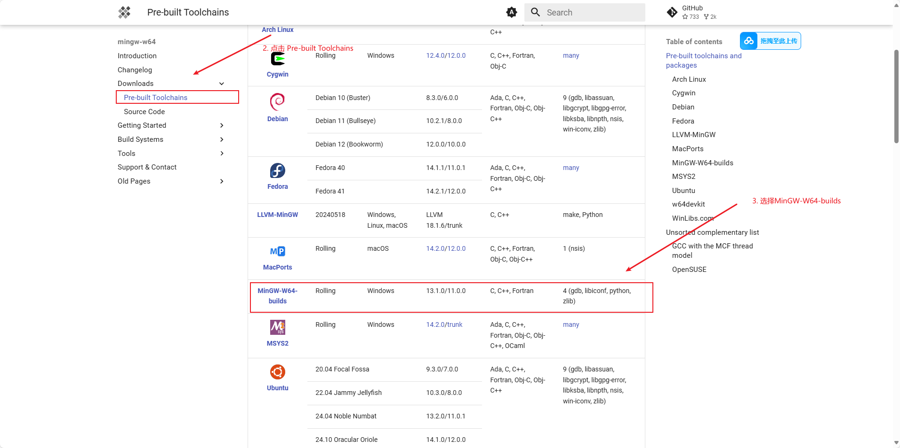
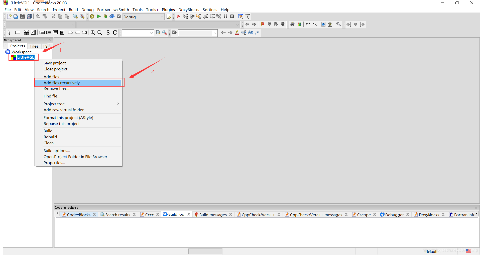
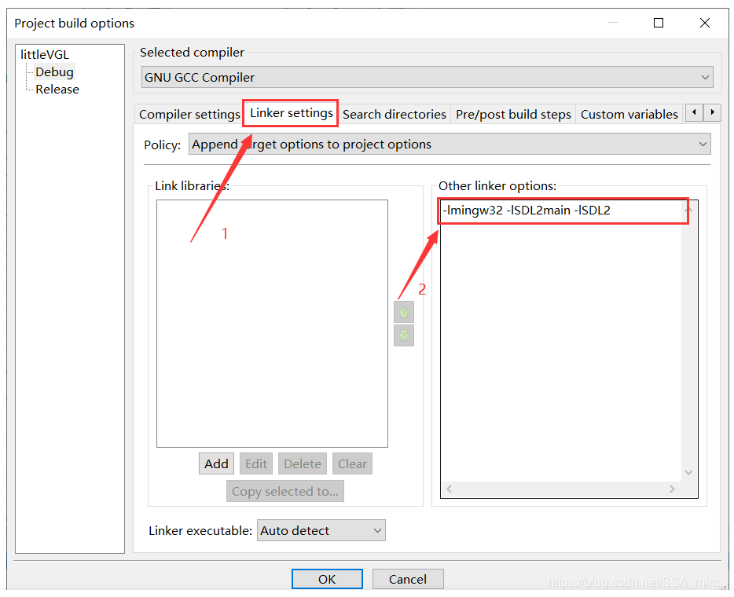

配置流程对于CodeBlocks 20.03版本以下的较为重要，对于最新版本的CodeBlocks可直接跳至“LVGL-V9移植”这一目录节点

# CodeBlocks 配置 LVGL 环境

## 搭建MinGW-w64环境
- 下载MinGW-w64安装包 
- 官方：https://www.mingw-w64.org

1. 进入官方页面后，点击Downloads按钮

 
 

2. 点击Pre-built Toolchains选项，然后进入下载选择页面，选择MinGW-W64-builds选项

 
 

3. 选择 **MinGW-W64-builds** 方式进行下载

 
 

4. 选择**msvcrt**的类型进行下载

 
 

5. 下载后解压文件到本地，然后复制路径后进入电脑环境变量配置，添加路径

 
 

6. 验证 **MinGW-W64编译**，命令提示符返回版本信息代表配置成功

 
 
 
 

## 搭建cmake环境

- 下载 Windows-cmake 安装包 
- 官方：https://www.cmake.org

1. 进入官方页面，点击Downloads按钮

 
 

2. 选择 **.msi** 的安装包进行下载

   
 
 

3. 随后进行傻瓜式安装，一路确定即可

 
 

4. 验证Cmake是否安装成功

 
 

## SDL2下载与环境搭建
**截止2025年4月20日，LVGL目前只支持SDL2，因此下载SDL2依赖包进行环境配置**
 
- 下载SDL2依赖包 
- 官方：https://www.libsdl.org

1. 进入SDL主页，点击SDL Releases 进入版本选择下载页面
 

 
 

2. 当前跳转的页面是SDL更新到的最新的版本页，点击Releases去上一个页面翻找之前的版本
 
 
 

3. 随便找一个SDL2的版本进行下载
  
 
 

## LittleVGL-V8构架导入
1. 在lv_pc_simulator文件夹中创建一个CodeBlocks文件夹，在文件夹中创建新工程，移除project中自动生成的main.c文件，删除在工程路径中的main.c文件

 
 
2. 解压lv_pc_simulator文件夹，找到Comment文件夹，将Comment文件夹中的三个压缩文件解压，移动到蓝色框选的相应的文件夹中

 
 

3. 递归添加

 
 

4. 选择最外层根目录，即 lv_pc_simulator 文件夹，添加过程中会弹出两个配置窗口，我们默认设置就行，添加成功

 
 

5. 随后在**x86_64-w64-mingw32**文件夹中找到**include**文件夹，将include文件夹中的SDL2粘贴复制到工程文件路径下

 
 

6. 到下载好解压后的SDL文件中，找到**x86_x64-w64-mingw32**文件下的**lib**文件夹中的7个.a后缀的文件，全部复制
  

 
 

7. 将复制的7个.a文件粘贴到Codeblocks安装目录下的MinGW文件夹中的lib文件夹下（注意：当前版本使用的CodeBlocks的版本应当<=20.03，此时将上面下载的MinGW-W64的全部内容粘贴到CodeBlocks安装目录下的MinGW文件夹中，安装自带的MinGW全部删掉进行替换）

 
 

8. 最后对CodeBlocks进行配置，选中工程文件，单击右键，选择“Bulid Options”,在linker settingsh中的Other linker options中添加-lmingw32 -lSDL2main -lSDL2

 
 

9. 选择"Search directories"，在Compiler中添加头文件路径，我们选中最外层根目录即可

 
 

10.  运行试调，产生SDL2.dll丢失类型报错，我们需要将SDL2文件夹中的SDL2.dll添加到工程Debug文件夹中

 
 

11. 配置完成，若第一次编译报错，退出CodeBlocks，对环境配置进行更改，要把上一次工程生成的文件删除，否则容易引发报错

 
 

12. 运行模拟器

 
 
 
 

## LVGL-V9源码文件说明

**目录说明：**

- demos： 存放的是LVGL一些综合的内置示例，部分示例可以再https://lvgl.io/demos体验
- docs: 存放LVGL的开发文档，阅读时一般不在这里直接阅读，而是在LVGL的文档站点阅读：https://docs.lvgl.io/9.2
- env_support: 一些环境或者平台的支持，比如我们所使用的RT-Thread就在其中
- examples：存放LVGL的内置示例
- scripts：存放一些处理脚本，我们在使用LVGL时基本不会用到
- src：存放LVGL实际的源码，我们使用LVGL进行开发时，都是使用这里的代码文件
- tests：存放一些CI测试文件，我们在使用LVGL时不会用到

 
 

## LVGL-V9移植
1. 官方针对codeblocks在github上有一个移植例程，首先通过上面的LVGL文档站点阅读链接进入v9.2版本阅读站

 
 

2. 选择LVGL的移植平台

 
 

3. 通过点击链接就进入到了github页面，然后选择当前的版本分支v9.2，下载这个代码架构

 
 

4. 将下载的lvgl-v9.2的核心代码驱动（就是上面的代码目录所展示的所有的文件）直接全部剪切到这个codeblocks代码构架目录中的lvgl文件夹中，然后就可以直接通过编译运行LVGL的测试例程了

