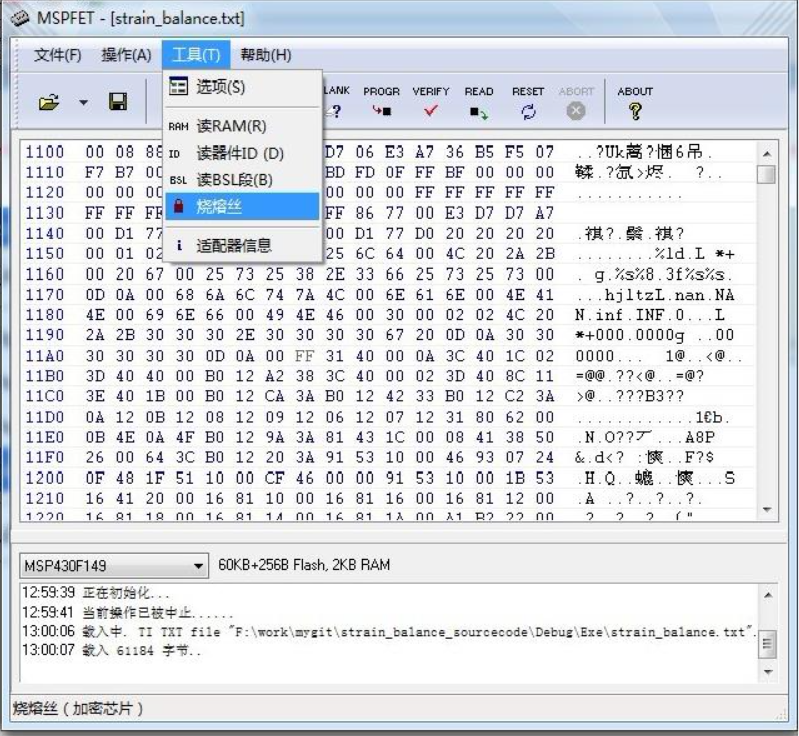

# CCS生成.hex文件

1. 选中工程项目文件，点击鼠标右键，弹出菜单栏，然后点击“Properties”进入属性配置；

 
 

2. 按图示流程选择生成.hex文件

 
 

# 使用BSL方式烧录.hex文件

## 下载MSPFET工具
- 下载MSPFET工具包
- 通过网盘分享的文件：MSP430_BLS_Download_Tool.rar
链接: https://pan.baidu.com/s/19U1Gx20U0BPvkpq1noY4eg?pwd=sd5k 提取码: sd5k 
--来自百度网盘超级会员v8的分享

## 使用MSPFET烧录程序流程

1. 在MAPFET的主界面下，选择合适单片机类型,然后打开存放在项目中的*.txt文件；

 
 

2. 按图配置环境

 
 

3. 导入.hex文件，首先进行ERASE操作，然后进行PROGR操作（或者直接点击Auto自动烧录）

## 注意事项
保险丝熔断！！切勿进行如下图所示的操作，防止单片机锁死！锁死单片机后将不能再进行JTAG方式的仿真调试！！！

