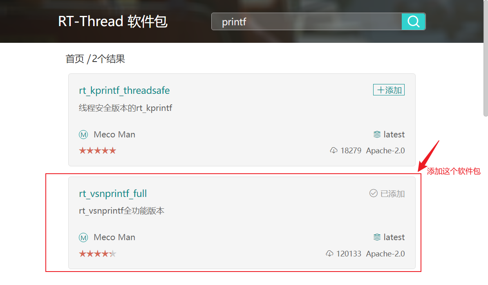

<style>
.red {
  color: #ff0000;
}
.green {
  color:rgb(10, 162, 10);
}
.blue {
  color:rgb(17, 0, 255);
}

.wathet {
  color:rgb(0, 132, 255);
}
</style>


```bash
create_at： 2025/10/30
aliases：   1.使用rt_vsnprintf_full组件打印浮点数
```
## <span class="green"><font size=2>1. 添加rt_vsnprintf_full软件包 </font></span>
<font size=2>

到RT-Thread Settings中添加如下图所示的软件包。



</font>

## <span class="green"><font size=2>2. 添加rt_vsnprintf_full软件包 </font></span>
<font size=2>

到RT-Thread Settings中添加如下图所示的软件包。


</font>

