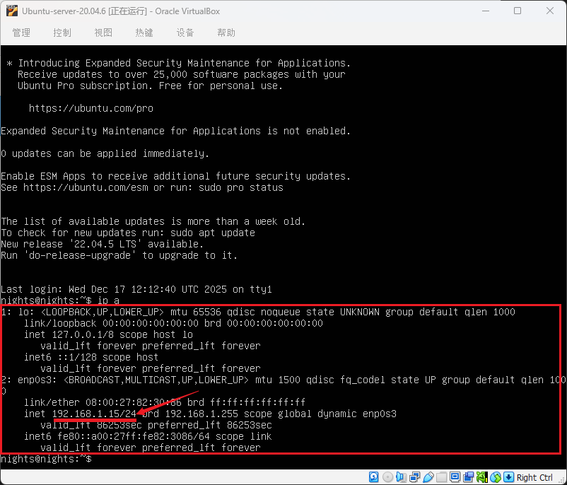
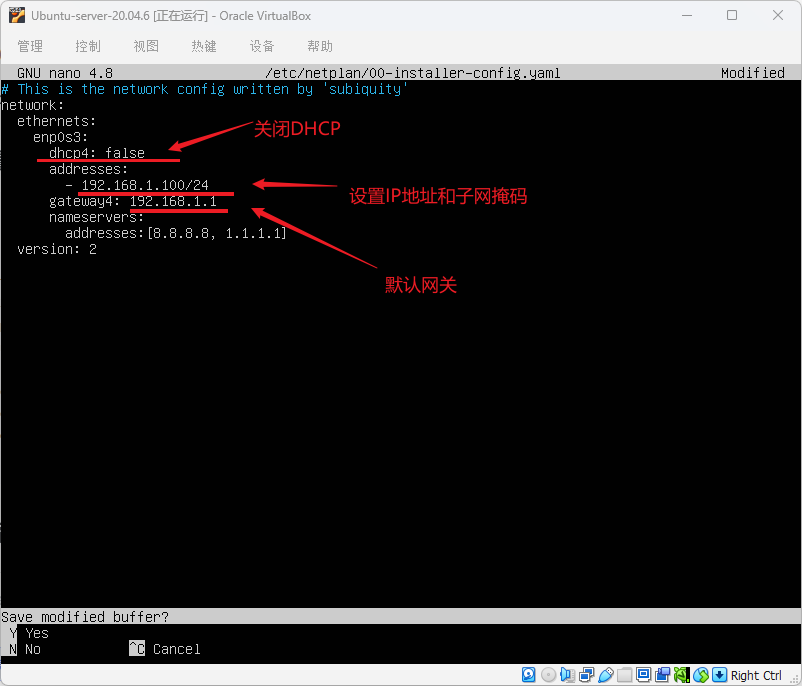
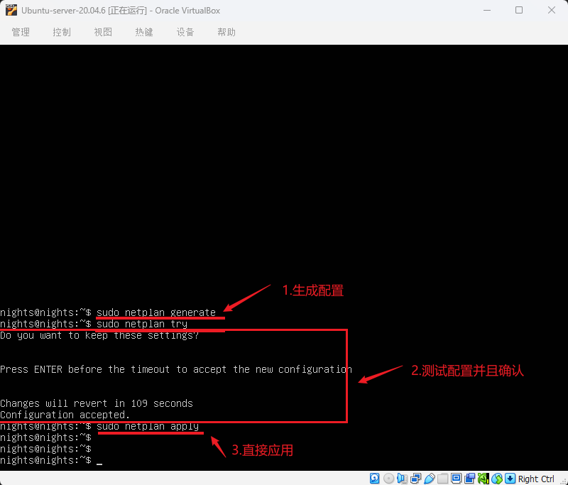
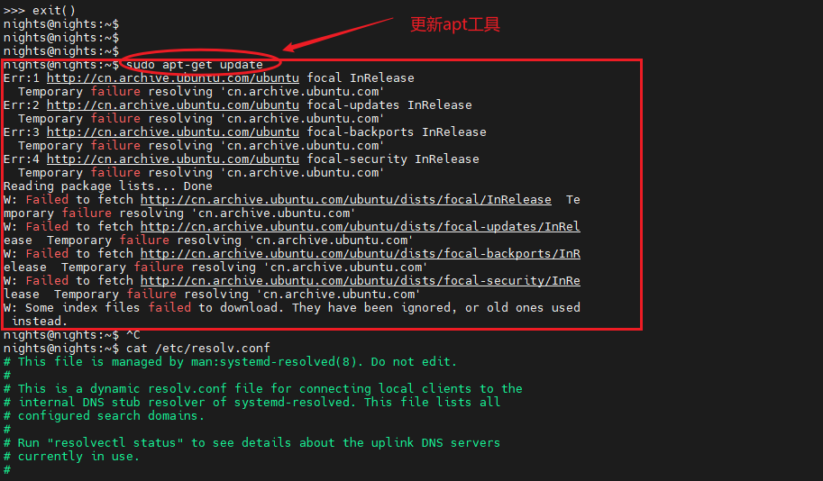
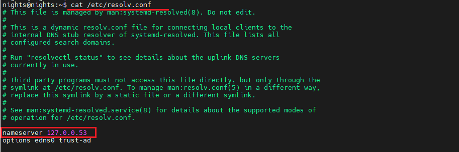

<style>
.highlight{
  color: white;
  background: linear-gradient(90deg, #ff6b6b, #4ecdc4);
  padding: 5px;
  border-radius: 5px;
}

.mint_green{
  color: white;
  background: #adcdadf2; 
  padding: 5px;
  border-radius: 5px;
}

.red {
  color: #ff0000;
}
.green {
  color:rgb(10, 162, 10);
}
.blue {
  color:rgb(17, 0, 255);
}

.wathet {
  color:rgb(0, 132, 255);
}
</style>


# <span class="wathet"><font size=4>Ubuntu初始软件配置与安装</font></span>
## <font size=3>一、软件安装</font>
<font size=2>

[Ubuntu-Server-ESP32安装步骤](Ubuntu-Server-ESP32安装步骤.md)

</font>

---


## <font size=3>二、网络设置</font>
<font size=2>

<div style="background:#e8f5e8;padding:10px;border-radius:6px;color:#333;">
ℹ️ 为了方便在 Windows 系统种使用 MobaXTerm 对 Linux-server 进行运维管理，需要设置一下 Ubuntu的静态IP地址，以方便每次进行远程连接。<br>
</div>


### <font size=2>使用Netplan进行IP地址设置</font>
```bash
# 确定网络接口名称
ip a
```



```bash
# 备份原配置
sudo cp /etc/netplan/00-installer-config.yaml /etc/netplan/00-installer-config.yaml.backup
# 编辑配置文件
sudo nano /etc/netplan/00-installer-config.yaml
```



```bash
# 生成配置
sudo netplan generate  
# 测试配置（按Enter确认）
sudo netplan try       
# 或直接应用
sudo netplan apply
```



```bash
# 查看IP地址
ip a

# 测试网络连接
ping -c 4 8.8.8.8

# 查看路由
ip route show
```

### <font size=2>DNS配置</font>

<div style="background:#e8f5e8;padding:10px;border-radius:6px;color:#333;">
ℹ️ 在更新以及下载工具链时， Ubuntu 系统无法解析域名，导致更新失败。<br>
</div>




<span class="blue">1. 绕过 DNS 直接测试网络系统的连通性</span>

```bash
# 测试 IP 连通性
ping -c 4 8.8.8.8

# 如果能通，说明网络没问题，问题在 DNS
# 如果超时，说明网络本身未连接（检查网线/Wi-Fi、路由器）
```

<span class="blue">2. 查看系统使用的 DNS 服务器</span>

```bash
cat /etc/resolv.conf
```


```bash
resolvectl status
```
你会看到类似输出，注意 Current DNS Server 是否为空或不可用：
```bash
Global
         Protocols: -LLMNR -mDNS -DNSOverTLS DNSSEC=no/unsupported
  resolv.conf mode: stub

Link 2 (eth0)
    Current Scopes: DNS
Current DNS Server:  # <- 这里可能是空的！
       DNS Servers: 
```

<span class="blue">3.修改 DNS 配置</span>

```bash
# 编辑配置文件
sudo nano /etc/systemd/resolved.conf

# 取消注释并修改为公共 DNS：
DNS=8.8.8.8 8.8.4.4 1.1.1.1  # Google + Cloudflare DNS
# 或阿里云的：
# DNS=223.5.5.5 223.6.6.6

# 重启服务
sudo systemctl restart systemd-resolved
sudo systemctl enable systemd-resolved
```

<span class="blue">4.测试 DNS 解析</span>

```bash
# 测试解析
nslookup cn.archive.ubuntu.com
# 或
dig cn.archive.ubuntu.com

# 成功应返回 IP 地址（如 91.189.91.83）
```

<span class="blue">5.重新尝试更新</span>


</font>


---

## <font size=3>三、个性化配置</font>
<font size=2>


### <font size=2>终端颜色配置</font>

```bash
# 生成默认颜色配置：
						dircolors -p > ~/.dircolors
# 编辑颜色规则： 
						nano ~/.dircolors
# 找到DIR条目并修改：
						DIR 01;36  # 目录颜色：粗体 + 青色
# 加载配置到 ~/.bashrc：
						echo 'eval "$(dircolors ~/.dircolors)"' >> ~/.bashrc
						source ~/.bashrc

```

</font>

