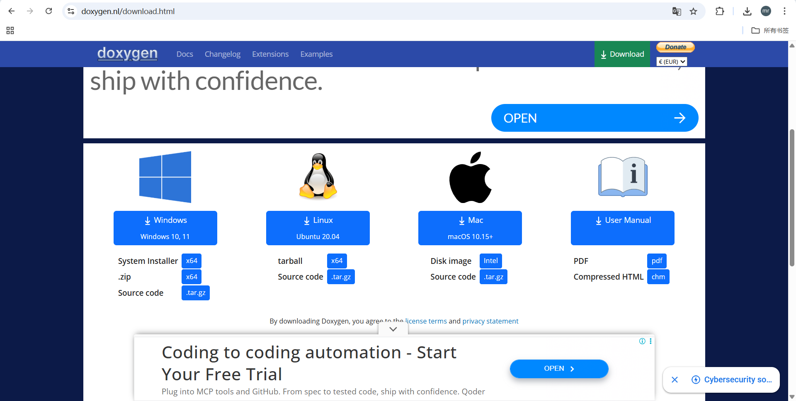
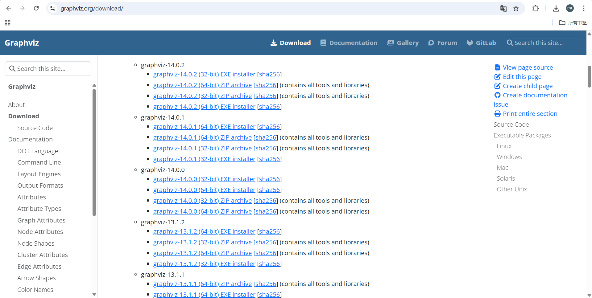
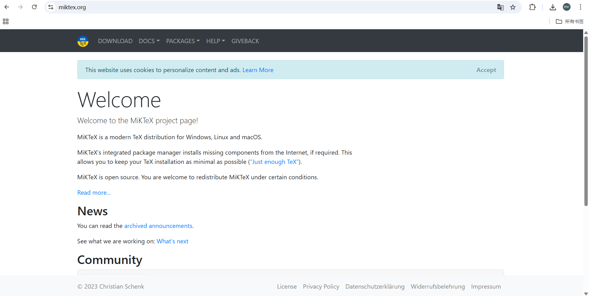
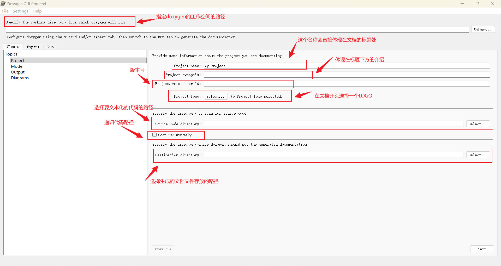
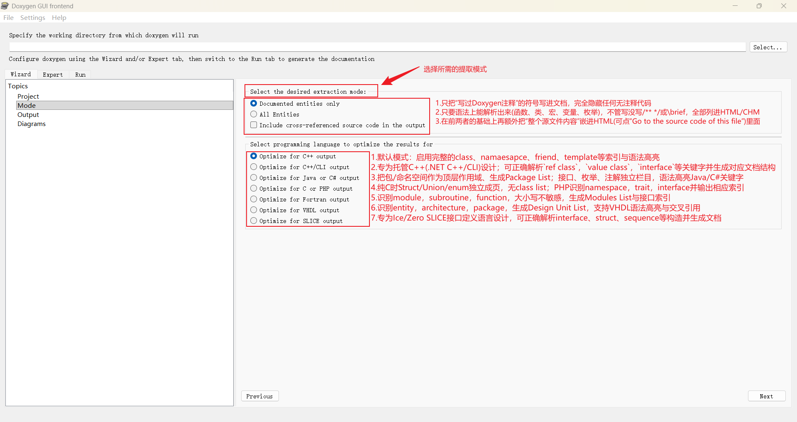

<style>
.highlight{
  color: white;
  background: linear-gradient(90deg, #ff6b6b, #4ecdc4);
  padding: 5px;
  border-radius: 5px;
}

.mint_green{
  color: white;
  background: #adcdadf2; 
  padding: 5px;
  border-radius: 5px;
}

.red {
  color: #ff0000;
}
.green {
  color:rgb(10, 162, 10);
}
.blue {
  color:rgb(17, 0, 255);
}

.wathet {
  color:rgb(0, 132, 255);
}
</style>


# <span class="wathet"><font size=4>Doxygen&Graphviz&Miktex 联合使用C/C++代码注释文档自动化实现</font></span>
## <font size=3>一、安装 Doxygen</font>
<font size=2>
<div style="background:#e8f5e8;padding:10px;border-radius:6px;color:#333;">
ℹ️ <span class="red">Doxygen是一款开源、跨平台(Win/Linux/macOS)、基于命令行以及GUI的自动化文档生成器。</span> Doxygen 是从带注释的 C++ 源代码生成文档的事实上的标准工具，但它也支持其他流行的编程语言，如 C、Objective-C、C#、PHP、Java、Python、IDL（Corba、Microsoft 和 UNO/OpenOffice 版本）、Fortran，以及在一定程度上支持 D 语言。Doxygen 还支持硬件描述语言 VHDL。<br>
</div>

[Doxygen官方下载链接](https://www.doxygen.nl/download.html) ：```https://www.doxygen.nl/download.html```



</font>

## <font size=3>二、安装 Graphviz</font>
<font size=2>
<div style="background:#e8f5e8;padding:10px;border-radius:6px;color:#333;">
ℹ️ <span class="red">Graphviz 是一个 开源的“图（graph）描述语言 + 渲染引擎”套装，</span>它最核心的理念是：<span class="red">用纯文本声明“节点”与“边”，自动完成布局、布线、着色、输出成图片/SVG/PDF。</span>因为“文本即源码”，所以天然适合被程序调用——Doxygen、Git、CMake、Sphinx、PlantUML、gdb 等工具都把它作为后台绘图引擎。<br>
</div>

[Graphviz官方下载链接](https://graphviz.org/download/) ：```https://graphviz.org/download/```



</font>


## <font size=3>三、安装 Miktex</font>
<font size=2>

<div style="background:#e8f5e8;padding:10px;border-radius:6px;color:#333;">
ℹ️ Miktex 是 Windows/macOS/Linux 上最老牌、最轻量的 TeX 发行版（distribution）。它可以把 .tex 源文件变成 PDF，而且 “只装你真正用到的宏包”，对硬盘、带宽都极友好，因此被 Doxygen、Pandoc、LyX、TeXstudio 等工具默认选为后台编译引擎。
<br>

**<span class="red">LaTeX 的核心只有几百个基础命令；想要插图、画表格、写中文、加超链接、排版代码……都得靠 宏包（实质是一组 .sty 文件 + 字体 + 文档）。TeX Live 全集合版一口气放了 4000+ 个宏包 ≈ 4 GB 但普通文档通常只用十几个；MiKTeX 利用这一点做了“懒加载”。</span>**<br>
</div>
<br>

[Miktex 官方下载链接](https://miktex.org/) ：```https://miktex.org/```




## <font size=3>四、Doxygen使用教程</font>

<font size=2>

**1. 首先要创建一个**



**2. MODE页面介绍**
**Select the desired extraction mode**

| 模式                                               | 说明                                                                                                 |
| -------------------------------------------------- | ---------------------------------------------------------------------------------------------------- |
| Documented entities only                           | 只把“写过 Doxygen 注释”的符号写进文档，完全隐藏任何无注释代码                                        |
| All Entities                                       | 只要语法上能解析出来（函数、类、宏、变量、枚举……），不管有没有写 /** */ 或 \brief，全部列进 HTML/CHM |
| Include cross-referenced source code in the output | 在前两者基础上再额外把“整个源文件内容”嵌进 HTML（可点“Go to the source code of this file”查看）      |


**Select programming language to optimize the results for**

| 模式                            | 说明                                                                                                              |
| ------------------------------- | ----------------------------------------------------------------------------------------------------------------- |
| Optimized for C++ output        | **默认模式**；启用完整的 class、namespace、friend、template 等索引与语法高亮；最适合普通 C++ 项目。               |
| Optimized for C++/CLI output    | 专为托管 C++（.NET C++/CLI）设计；可正确解析 `ref class`、`value class`、`interface` 等关键字并生成对应文档结构。 |
| Optimized for Java or C# output | 把包/命名空间作为顶层作用域，生成 Package List；接口、枚举、注解独立栏目；语法高亮适配 Java/C# 关键字。           |
| Optimized for C or PHP output   | 纯 C 时 struct/union/enum 独立成页，无 Class List；PHP 时识别 namespace、trait、interface 并输出相应索引。        |
| Optimized for Fortran output    | 识别 module、subroutine、function；大小写不敏感；生成 Modules List 与接口索引。                                   |
| Optimized for VHDL output       | 识别 entity、architecture、package；生成 Design Unit List，支持 VHDL 语法高亮与交叉引用。                         |
| Optimized for SLICE output      | 专为 Ice/Zero SLICE 接口定义语言设计；可正确解析 interface、struct、sequence 等构造并生成文档。                   |




**3. Output页面介绍**


</font>
