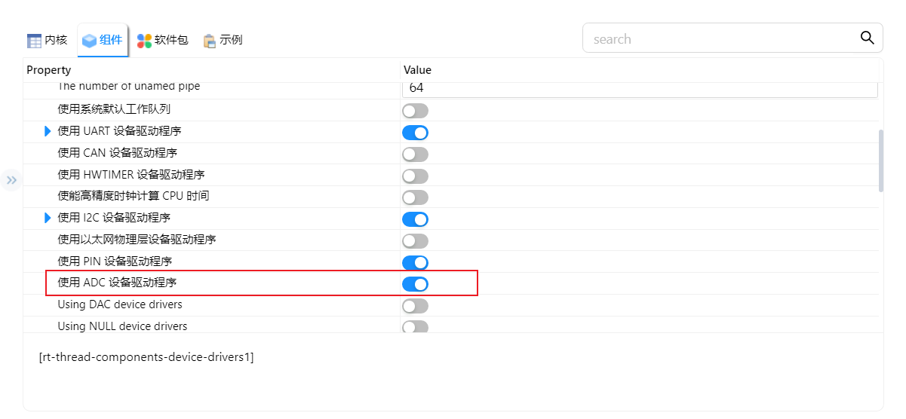
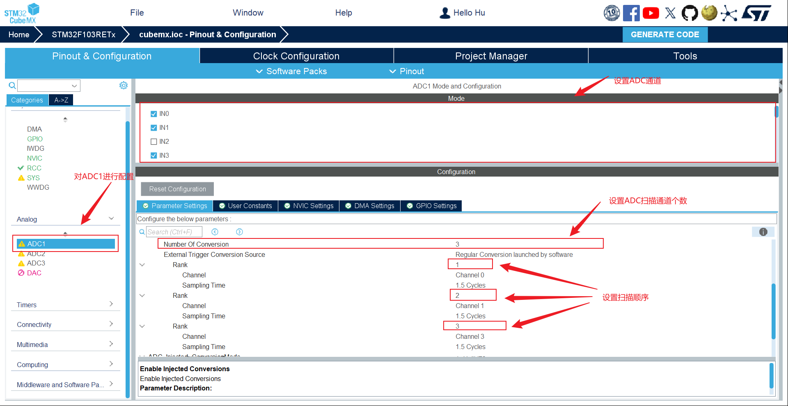
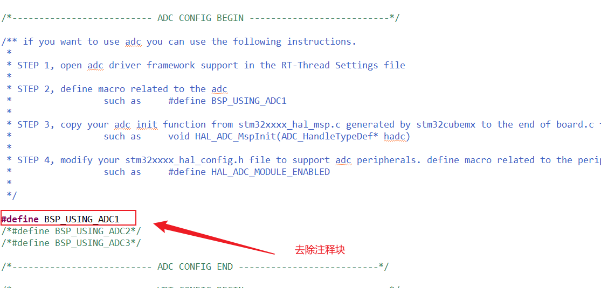

<style>
.red {
  color: #ff0000;
}
.green {
  color:rgb(10, 162, 10);
}
.blue {
  color:rgb(17, 0, 255);
}

.wathet {
  color:rgb(0, 132, 255);
}
</style>


# <span class="green"><font size=3>一、环境选择与配置</font></span>
```bash
create_at：2025/07/29
aliases：使用RT-Thread Studio 配置ADC检测组件
```
## <font size=2>1.打开RT-Thread Settings使能ADC配置</font>

<font size=2>点击"组件" --> 找到"设备驱动程序" --> 点击"使用ADC设备驱动程序"</font>



## <font size=2>2.cubemx生成adc配置代码</font>
<font size=2>以STM32F103RET6的PA0、PA1为例，设置ADC通道IN0、IN1，设置为扫描模式。</font>



## <font size=2>3.整理cubemx生成后的程序</font>
<font size=2>把stm32f1xx_hal_msp.c中的程序转移到board.c文件中，然后在board.h文件中找到"BSP_USING_ADC1"定义宏，去除注释块</font>



# <span class="green"><font size=3>二、代码移植</font></span>
## <font size=2>1.宏定义ADC设备名称以及ADC通道</font>
```C
#define ADC1_DEVICE_NAME    "adc1"  /* 设备名称 */
#define ADC_CH0_CHANNEL     0       /* 充电电流监测通道数据ADC输出通道 */
#define ADC_CH1_CHANNEL     1       /* 电池电压数据ADC输出通道 */


#define REG_VOL_3V3         3.3     /* ADC的参考电压 */
#define REG_VOL_5V0         5.0     /* ADC的参考电压 */
#define CONVERT_BITS        12      /* 分辨率 */
#define SAMPLE_NUM          8       /* 采样次数 */
```
## <font size=2>2.ADC设备结构体初始化</font>
```C
/**
  * @brief  Used to initialize ADC devices and channels
  * @retval None
  */
typedef struct {
    char adc_dev1_name[16];             /* adc设备名称 */
    int  adc_channel_0;                 /* adc输出通道0 */
    int  adc_channel_1;                 /* adc输出通道1 */

    struct rt_device_adc *adc_dev;
}_adc_init;

/**
  * @brief  ADC1 Initialization
  * @retval None
  */
static _adc_init adc_dev1   = {
        .adc_dev1_name      =   ADC1_DEVICE_NAME,
        .adc_channel_0      =   ADC_CH0_CHANNEL,
        .adc_channel_1      =   ADC_CH1_CHANNEL,
};

```
## <font size=2>3.初始化ADC函数以及通道并创建扫描线程</font>
```C
/**
  * @brief  adc Device Initialization
  * @retval int
  */
int ADC_Init(void)
{

    adc_dev1.adc_dev = (struct rt_device_adc*)rt_device_find(adc_dev1.adc_dev1_name);
    if(adc_dev1.adc_dev != RT_NULL){
        rt_kprintf("PRINTF:%d. adc1 device is created !! \r\n",Record.kprintf_cnt++);
    }
    else {
        rt_kprintf("PRINTF:%d. adc1 device created failed !! \r\n",Record.kprintf_cnt++);
        return RT_ERROR;
    }

    rt_adc_enable((rt_adc_device_t)adc_dev1.adc_dev, adc_dev1.adc_channel_0);
    rt_adc_enable((rt_adc_device_t)adc_dev1.adc_dev, adc_dev1.adc_channel_1);

    return RT_EOK;
}

void adc_thread_entry(void* parameter)
{
    char buffer[256]; // 用于存储格式化后的字符串
    rt_uint32_t tp5400_prog_adc_values = 0;
    rt_uint32_t tp5400_bat_adc_values = 0;
    rt_uint32_t check_power_tick = 0;
    float tp5400_prog_current = 0;
    float tp5400_battery_vol = 0;
    battery_recharge_enable();
    while(1)
    {

        for(int i = 0; i < SAMPLE_NUM; i++){
            tp5400_prog_adc_values += rt_adc_read((rt_adc_device_t)adc_dev1.adc_dev, adc_dev1.adc_channel_0);
            tp5400_bat_adc_values += rt_adc_read((rt_adc_device_t)adc_dev1.adc_dev, adc_dev1.adc_channel_1);
            rt_thread_mdelay(5);
        }

        /*! 计算充电电流值 */
        tp5400_prog_current = battery_get_current_data(tp5400_prog_adc_values);
        /*! 计算电池电压值 */
        tp5400_battery_vol = battery_get_vol_data(tp5400_bat_adc_values);

        // 格式化字符串
        rt_snprintf(buffer, sizeof(buffer),
                    "current Data = %.1f mA \r\n"
                    "voltage Data = %.2f  V \r\n",
                tp5400_prog_current, tp5400_battery_vol);

        // 将格式化后的字符串写入串口
        rt_kprintf("%s\r\n",buffer);

        rt_uint8_t charge_flag = battery_check_if_recharging();

        if(check_power_tick < 3000)
        {
            check_power_tick++;
            if(battery_check_if_power_full() == 1 && charge_flag == 1){
                rt_kprintf("Battery's power is full\r\n");
            }
            else if(battery_check_if_power_full() == 0 && charge_flag == 1){
                rt_kprintf("Battery's power is not full\r\n");
            }
        }
        else{
            check_power_tick = 0;
        }


        rt_thread_mdelay(10);
    }
}

/**
  * @brief  初始化数据解码函数
  * @retval int
  */
rt_thread_t ADC_Thread_Handle;
int ADC_Thread_Init(void)
{
    ADC_Thread_Handle = rt_thread_create("adc_thread_entry", adc_thread_entry, RT_NULL, 1024, 11, 300);
    if(ADC_Thread_Handle != RT_NULL){
        rt_kprintf("PRINTF:%d. ADC Thread is created!!\r\n",Record.kprintf_cnt++);
        ADC_Init();
        rt_thread_startup(ADC_Thread_Handle);
    }
    else {
        rt_kprintf("PRINTF:%d. ADC Thread is not created!!\r\n",Record.kprintf_cnt++);
    }

    return RT_EOK;
}
INIT_APP_EXPORT(ADC_Thread_Init);

```


