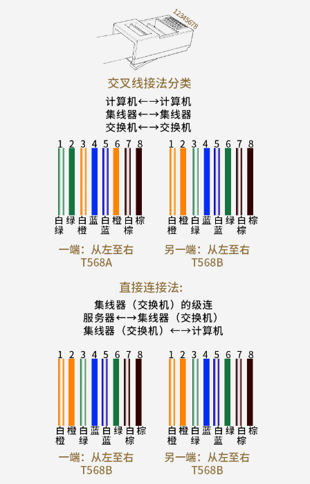

# 网线接法定义
## 一、网线水晶头接法

ℹ️ RS485转RJ45接线方法是一种常用的通信接口方案，用于连接不同设备之间的数据传输。常见的网线是586，有A、B标准，一般记住其中一个标准就可以了，另外一个标准只是1、3（发送），2、6（接收）的线序颠倒一下而已。

 

## 二、RJ45网口连接器

ℹ️ RJ-45连接器包括一个插头和一个插孔（或插座）。插孔安装在机器上，而插头和连接导线（现在最常用的就是采用无屏蔽双绞线的5类线）相连。EIA/TIA制定的布线标准规定了8根针脚的编号。不论是T568B标准，还是T568A标准，线序定义一致(按照数字1-8)，不按颜色。

| 引脚 | 功能                   |
| ---- | ---------------------- |
| 1    | 数据发送+(TX+)         |
| 2    | 数据发送-(TX-)         |
| 3    | 数据接收+(RX+)         |
| 4    | 未使用/保留            |
| 5    | (白蓝)未使用/保留      |
| 6    | 数据接收-(RX-)         |
| 7    | (白棕)保留/可用于PoE等 |
| 8    | 保留/可用于PoE等       |

 

## 二、接线建议以及注意事项
▪️常见的4口交换机，直接连1、2、3、6号引脚即可
▪️注意12,36,45,78必须是双绞线，也就是两个发送是双绞线，两个接收是双绞线（如果有时通有时不通，建议排查这个原因）
▪️接线建议：相同设备交叉线（T568B通T568A，也就是TX、RX交叉连 ），不同设备直通线（T568B通T568B，也就是TX、RX直通）

**做好一头是586B标准的网线，另一头抽出两根线“白绿、绿”，绿色的线接在转接头D+上，白绿的线D-上，这样485转RJ45的数据线就做好了。**

参考电路设计：
https://mp.weixin.qq.com/s?__biz=MzIwNTMyNTc2Mw==&mid=2247483834&idx=1&sn=25e6b50fe63911048c834cb7478eed31&poc_token=HI8I12ijY9CUH1UBAqKsZ1Rs0CSMG7XUnSl5DFdJ

https://blog.csdn.net/sinat_30055139/article/details/143153513?ops_request_misc=%257B%2522request%255Fid%2522%253A%252272a08883f8223744d8e3a9ba252ad947%2522%252C%2522scm%2522%253A%252220140713.130102334..%2522%257D&request_id=72a08883f8223744d8e3a9ba252ad947&biz_id=0&utm_medium=distribute.pc_search_result.none-task-blog-2~all~sobaiduend~default-2-143153513-null-null.142^v102^pc_search_result_base7&utm_term=%E5%B7%AE%E5%88%86%E4%BF%A1%E5%8F%B7%E9%98%BB%E6%8A%97%E5%8C%B9%E9%85%8D%E7%94%B5%E9%98%BB&spm=1018.2226.3001.4187

