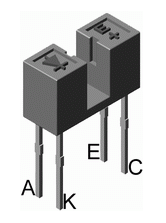
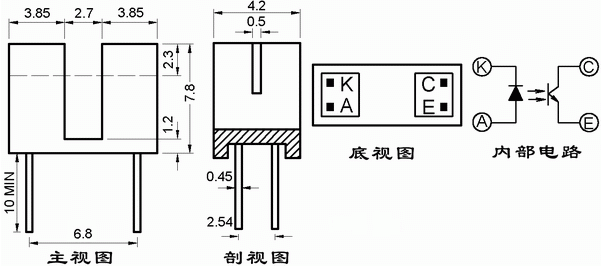
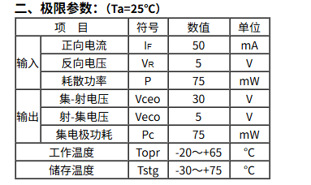
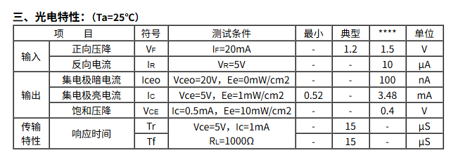
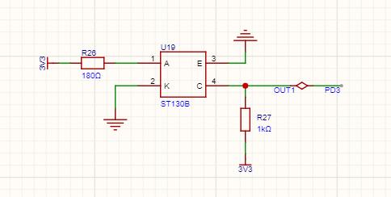

# ST130B说明

ST130B 是单光束直射式槽型红外光电开关，它的内部结构是由一个高发射功率的红外光电二极管和一个高灵敏度的NPN型晶体管组成。

# 工作原理说明

npn型光电开关是如何工作的呢？它的结构通常包括两个主要部分：发光器和接收器。发光器多采用发光二极管（LED），负责发射一束不可见光（如红外光）；接收器则是一个光电晶体管，专门检测这束光的变化。
**当没有物体阻挡光路时，光从发光器直射到接收器，光电晶体管被激活，产生电流。这时，npn晶体管作为输出元件，其基极接收到来自光电晶体管的信号，从而进入导通状态——集电极和发射极之间形成通路，输出一个“低电平”信号，表示物体不存在。** 
**反之，当物体阻挡光路时，光被中断，光电晶体管停止工作，npn晶体管的基极失去电流，导致它进入截止状态，输出“高电平”信号，** 触发外部设备（如电机或报警器）响应。这种设计，巧妙地利用了光敏效应和晶体管放大原理，实现高效检测。

# 电路设计说明
根据光电特性，在设计实际电路时，参考选取发射管的静态电流为20mA，即IF==20mA,典型的压降为1.25V，如果供电电压为5V，那么，此时在发射管上需要串联电阻，电阻大小为**R= $\frac{U}{V}$=$\frac{(5-1.25)}{0.02}$=187.5Ω**；取标称电阻R=200Ω，此时的电流小于20mA，但是不影响结果。

C_E端的电阻比较灵活，毕竟他是用来输出高低电平的，在此我们接一个2k的电阻，实际上下面的电路图中的可调电阻没有必要，只是为了测试方便，调整阈值电压用的。

