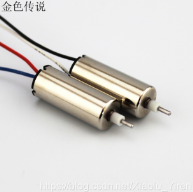

# 空心杯电机驱动电路

一般的小型四轴都选用空心杯电机来驱动旋翼，空心杯电机不仅节能而且灵敏，是一种比较理想的电机。



常用720空心杯电机，它是指直径是7mm长度为20mm的电机，同理我们可以估计其他一些型号的电机，如820、614等等。

除了尺寸参数，其电器参数如下：

```C
    电压：3.7V  
    转速：45000转/分钟   
    轴径：1mm
```

那简单，既然要求是3.7的电压，那我直接找个3.7V的电池直接把空心杯的两根线怼在电池的正负极不就好了（感兴趣的同学可以自己动手试试）。我自己试了一下，觉得转速挺大的，应该是能够带动四轴飞行的。