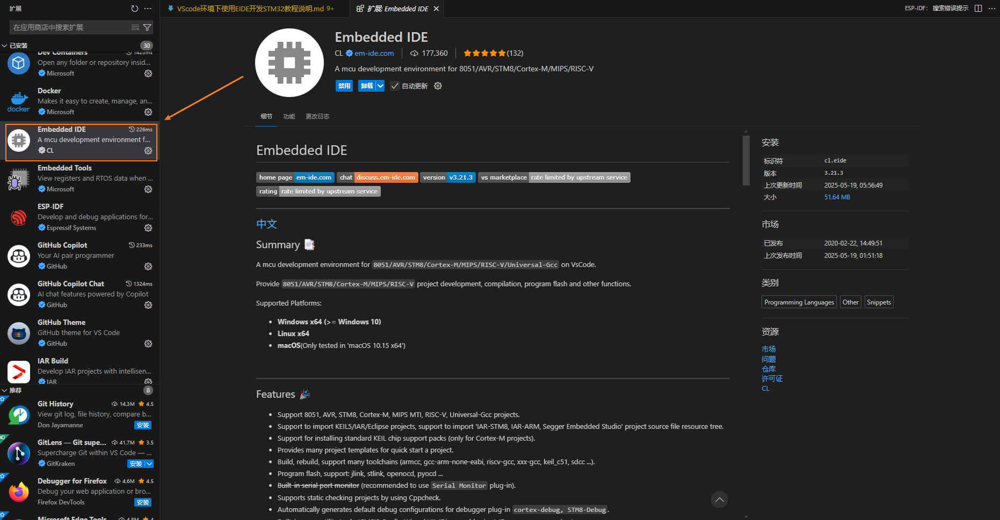
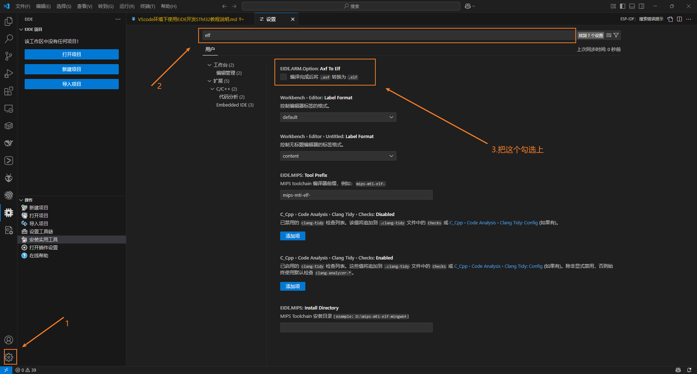
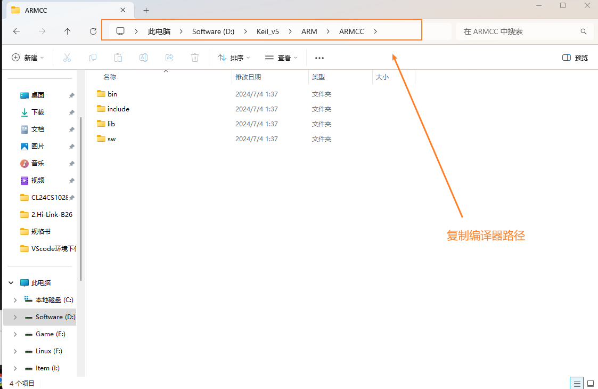
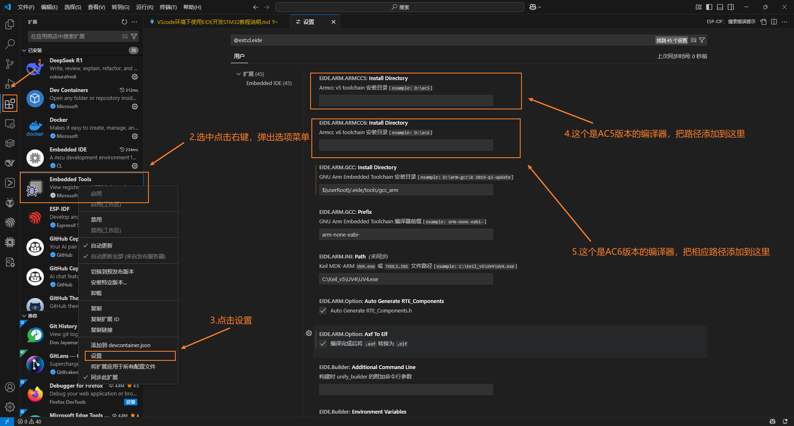
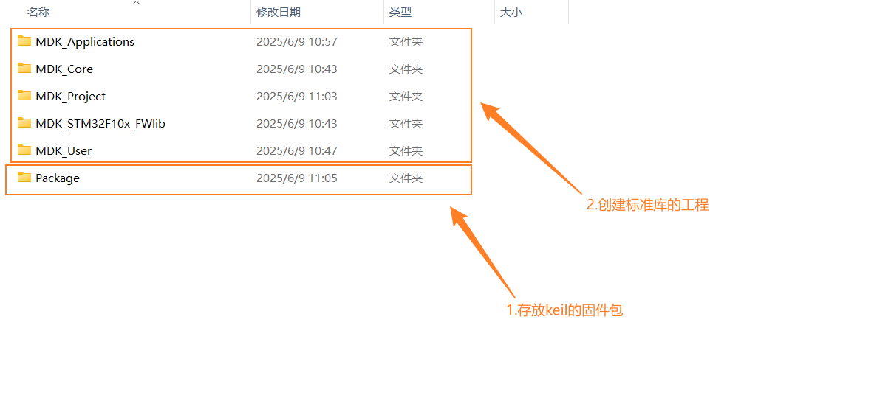
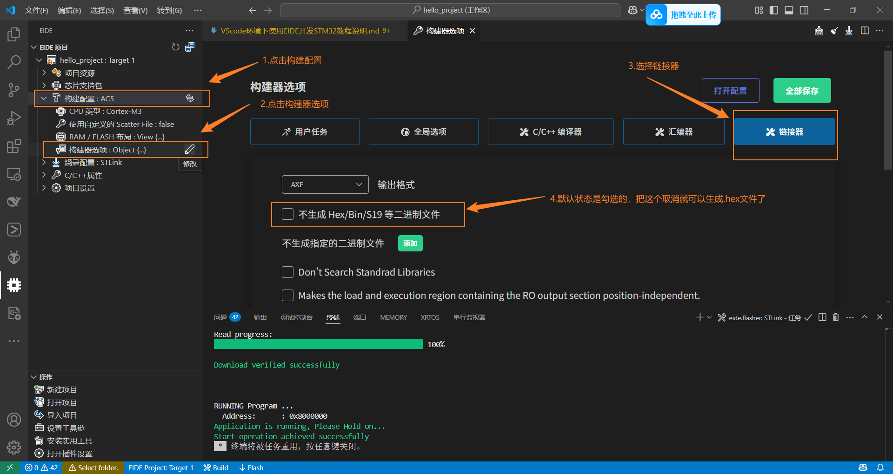
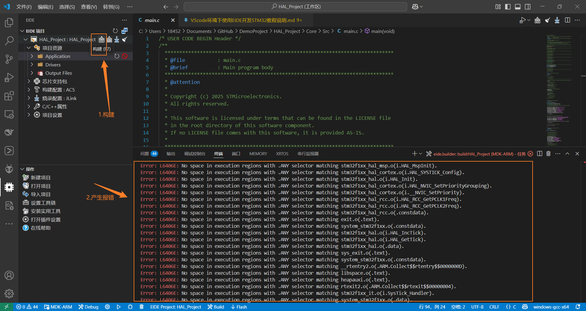

# 安装并配置EIDE插件

1. 进入到VScode的插件商城中，搜索 Embedded IDE 插件名称，点击安装

 
 

2. 在EIDE插件中的操作栏中点击“安装实用工具”选项，弹出下拉选项菜单，选择以下几个插件进行安装：
   - Cppcheck（Code Inspection）
   - GUN Arm Embedded Toolchain
   - OpenOCD Programmer

 
 

3. 配置EIDE，点击Setting，在setting的搜索栏中输入"elf",会弹出"EIDE.ARM.Option:Axf To Elf",把下面的"编译完成后将.alf 转换为 .elf"

4. 添加外部编译器依赖（也即Keil5安装路径下的编译器）
   - 先找到编译器路径并复制路径

   - 对EIDE进行扩展设置

5. 安装 STM32 Cube Programmer CLI 工具链，以便后面使用STLink工具烧录程序

 
 

# 标准库&Hal库MDK工程的导入
## 说明
对于标准库以及Hal库先按照原始的标准流程创建工程后，再用VSCode导入EIDE
 

## 导入MDK标准库工程
1. 创建一个HelloWorld工程，控制器使用STM32F105RBT6，串口打印“Hello World!”

2. 在工作区中使用EIDE导入MDK工程文件
- 导入MDK项目

- 选择ARM选项

- 导入keil5的工程文件

- 选择是否将EIDE文件与当前工程文件存在同一文件下

3. 导入板级支持包
- 选择离线导入

- 选择芯片对应的板级支持包

- 选择芯片类型

4. 编译

5. 下载烧录与调试
- 切换STLink烧录配置

- 点击烧录，如果弹出没生成.hex文件就到构建配置中，点击“构建器选项：Object{...}”，然后点击“链接器”，把页面上的“不生成.hex”选项给取消勾选，保存配置后，重新build，再进行烧录就可以了

## 导入STM32CubeMX生成的HAL库MDK工程
1. 按照STM32的标准配置流程，生成一个使用UART5串口的工程，生成指定MDK工程，然后导入EIDE中

2. 此时直接点击编译，会产生空间不足的报错

3. 点击  "构建配置：AC5" --> "RAM/FLASH布局:view{...}",可以看到Memory Ares下的空间地址配置有问题
- 打开生成的MDK工程，点击魔术棒，在Target界面下，可以看到Memory地址的配置值

- 按照MDK中的地址信息填入EIDE下的RAM/FLASH布局中
 

4. 编译
 
