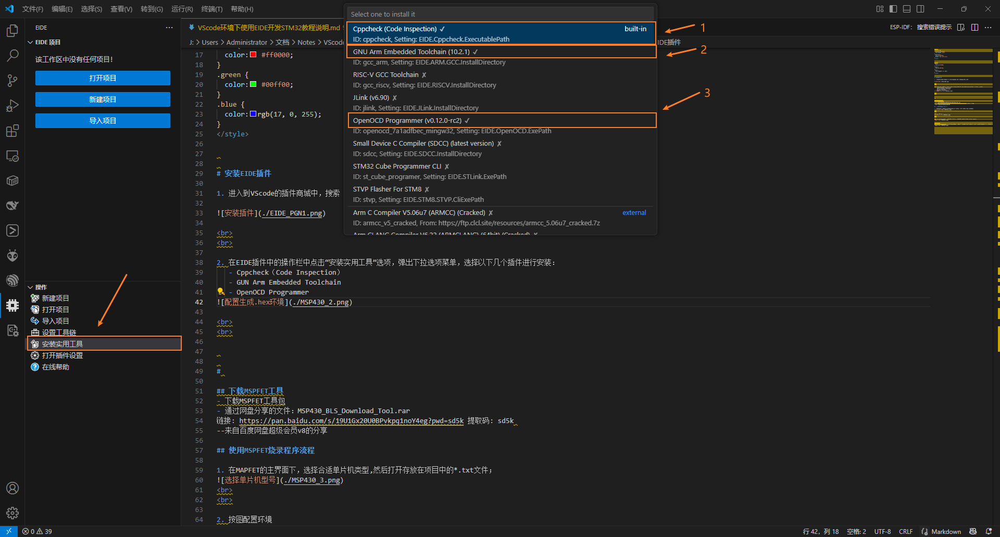

# 安装并配置EIDE插件

1. 进入到VScode的插件商城中，搜索 Embedded IDE 插件名称，点击安装

 
 

2. 在EIDE插件中的操作栏中点击“安装实用工具”选项，弹出下拉选项菜单，选择以下几个插件进行安装：
   - Cppcheck（Code Inspection）
   - GUN Arm Embedded Toolchain
   - OpenOCD Programmer

 
 

3. 配置EIDE，点击Setting，在setting的搜索栏中输入"elf",会弹出"EIDE.ARM.Option:Axf To Elf",把下面的"编译完成后将.alf 转换为 .elf"

1. 添加外部编译器依赖（也即Keil5安装路径下的编译器）
   - 先找到编译器路径并复制路径

   - 对EIDE进行扩展设置

 
 

# 使用STM32F103最小系统板进行编程测试

