<style>
.red {
  color: #ff0000;
}
.green {
  color: #00ff00;
}
.blue {
  color:rgb(17, 0, 255);
}
</style>


# VScode 配置 LVGL 环境

## 安装VScode的插件
- CMake Tools
- C/C++
- CMake
- Embedded IDE

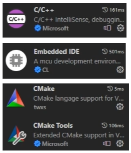


<br>
<br>

## 搭建MinGW-w64环境
- 下载MinGW-w64安装包
- 官方：https://www.mingw-w64.org

1. 进入官方页面后，点击Downloads按钮
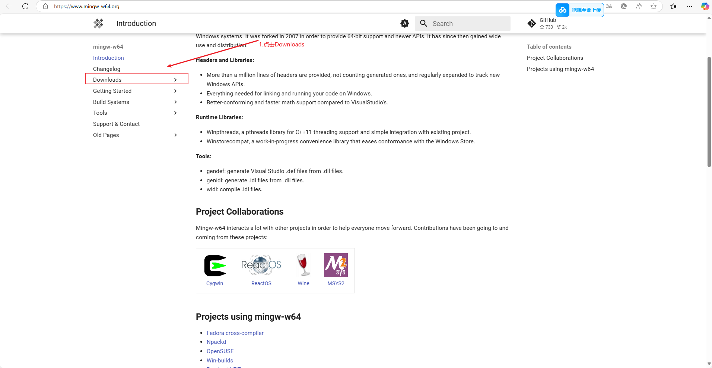

<br>
<br>

2. 点击<span class="red">Pre-built Toolchains</span>选项，然后进入下载选择页面，选择<span class="red">MinGW-W64-builds</span>选项


<br>
<br>

3. 选择 **MinGW-W64-builds** 方式进行下载


<br>
<br>

4. 选择**msvcrt**的类型进行下载


<br>
<br>

5. 下载后解压文件到本地，然后复制路径后进入电脑环境变量配置，添加路径


<br>
<br>

6. 验证 **MinGW-W64编译**，命令提示符返回版本信息代表配置成功
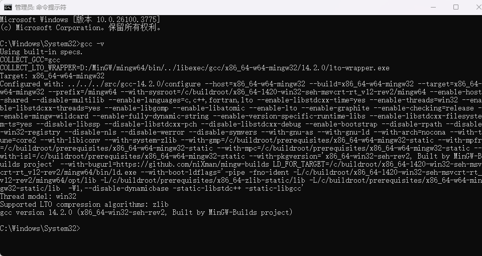


<br>
<br>
<br>
<br>


## 搭建cmake环境

- 下载 Windows-cmake 安装包
- 官方：https://www.cmake.org

1. 进入官方页面，点击Downloads按钮


<br>
<br>

2. 选择 **.msi** 的安装包进行下载


<br>
<br>

3. 随后进行傻瓜式安装，一路确定即可


<br>
<br>

4. 验证Cmake是否安装成功


<br>
<br>


## SDL2下载
**截止2025年4月20日，LVGL目前只支持SDL2，因此下载SDL2依赖包进行环境配置**
<br>
- 下载SDL2依赖包
- 官方：https://www.libsdl.org

1. 进入SDL主页，点击SDL Releases 进入版本选择下载页面
 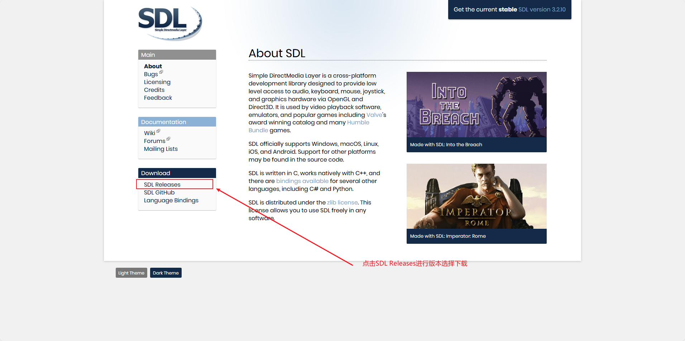

<br>
<br>

2. 当前跳转的页面是SDL更新到的最新的版本页，点击Releases去上一个页面翻找之前的版本
 
<br>
<br>

3. 随便找一个SDL2的版本进行下载
  
<br>
<br>

4. 将SDL2解压后的文件夹中的cmake和x86_64-w64-mingw32文件夹复制粘贴到mingw64的路径下面
  
<br>
<br>
<br>
<br>


# VScode搭建LVGL-V8.3的模拟器

- 下载LVGL-V8.3源码（官网：https://github.com/lvgl/lvgl/tree/release/v8.3 ）
- 下载lv_port_pc_eclipse模拟器项目（官网：https://github.com/lvgl/lv_port_pc_eclipse/tree/release/v8.3 ）
- 下载LVGL驱动源码（官网：https://github.com/lvgl/lv_drivers/tree/release/v8.3 ）

1. 新建一个工程文件夹，并将解压后的“lv_port_pc_eclipse-release-v8.3”文件夹中的全部文件剪切到新建的工程文件夹中

  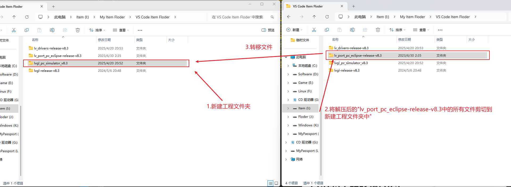
<br>
<br>

2. 对应的将lv_drivers-release-v8.3文件夹中的全部文件剪切到lv_drivers文件夹中
   对应的将lvgl-release-v8.3文件夹中的全部文件剪切到lvgl文件夹中
   
<br>
<br>

3. 将SDL2/SDL2-2.30.10/x86_64-w64-mingw32/bin文件夹中的SDL2.dll扩展文件复制到工程文件夹下
   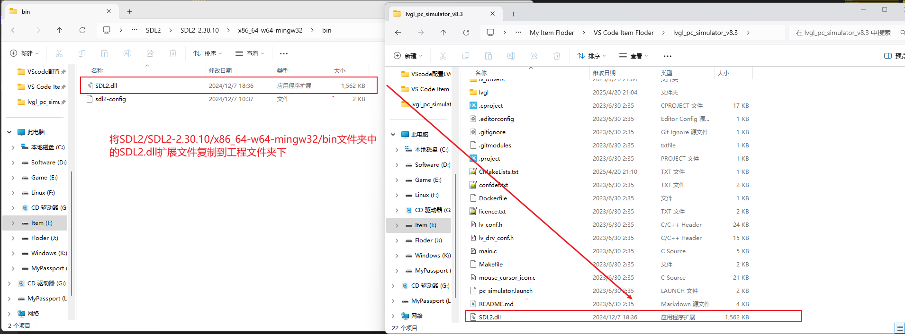
<br>
<br>

4. 修改最外层的CMakeLists.txt文件，让SDL2.dll动态链接库编译时自动拷贝SDL2.dll文件到bin目录下

```bash
# 拷贝SDL2.dll 文件到 bin目录下
file(COPY SDL2.dll DESTINATION ../bin)
```
   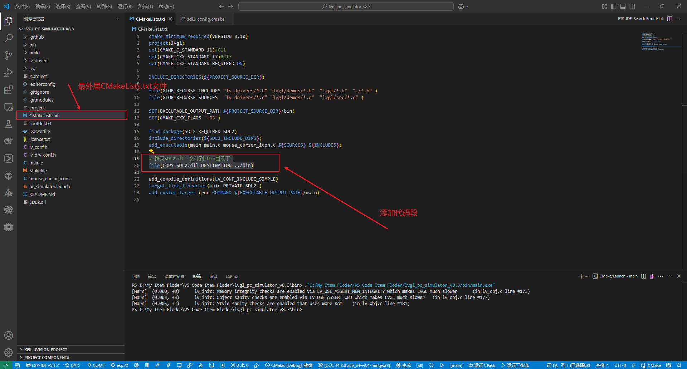
<br>
<br>

5. 修改“D:\MinGW\mingw64\x86_64-w64-mingw32\lib\cmake\SDL2\sdl2-config.cmake”路径下的sdl2-config.cmake中的内容<span class="red">(以上内容直接编译的话，会产生报错，因为拷贝到mingw64文件中的cmake文件路径不对，这里VScode会自动弹出需要修改的.cmake文件，也可以事先自行修改)</span>
  
  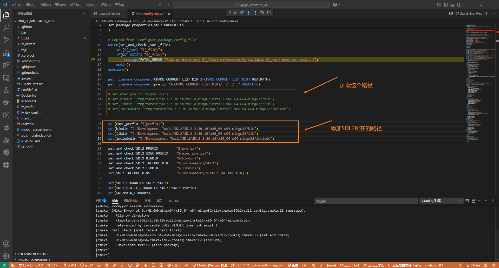
<br>
<br>


6. 配置完成，编译验证
   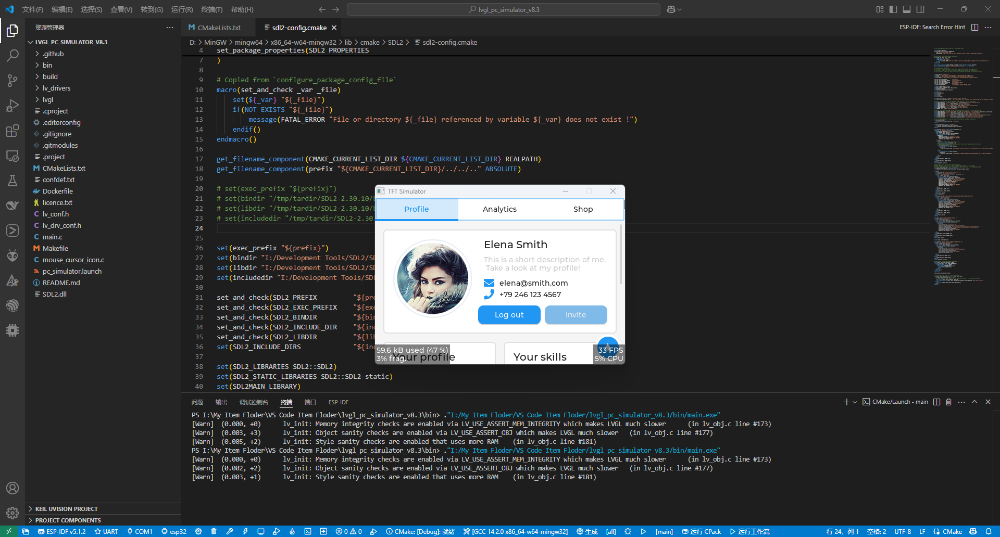
<br>
<br>
<br>
<br>


# VScode搭建LVGL-V9.2的模拟器

- 下载LVGL-V9.2源码（官网：https://github.com/lvgl/lvgl/tree/release/v9.2 ）
- 下载针对VScode的预配置工程包（官网：https://github.com/lvgl/lv_port_pc_vscode/tree/release/v9.2?tab=readme-ov-file%EF%BC%89 ）
- 下载FreeRTOS的内核源码（官网：https://github.com/FreeRTOS/FreeRTOS-Kernel ）

1. 解压下载好的资源包，然后将FreeRTOS内核全部代码剪切到VScode的预配置工程包中的FreeRTOS文件夹中，同时将lvgl源码全部剪切到VScode的预配置工程包中的lvgl文件夹中,然后自己再新建一个工程文件，将**lv_port_pc_vscode-master文件夹**中的所有文件移植到这个新建的工程文件夹中

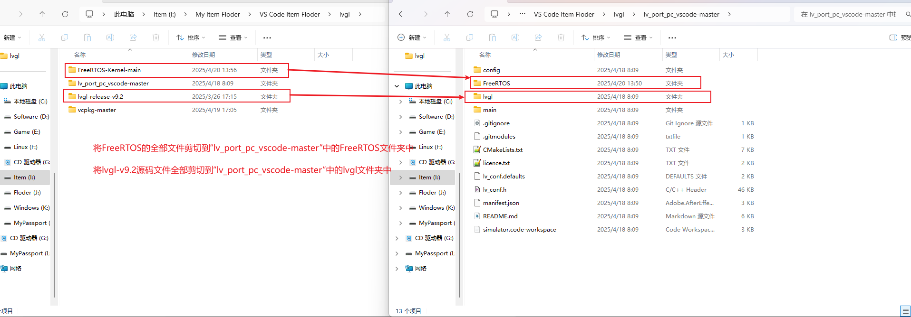
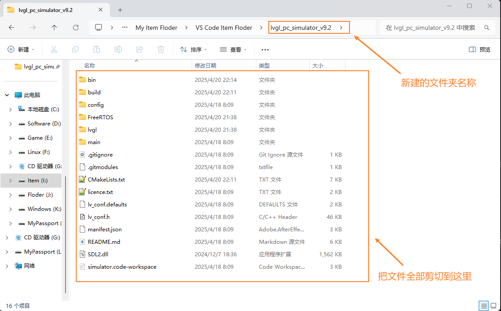
<br>
<br>


2. 点击“lv_port_pc_vscode-master”文件夹中的simulator.code-workspace文件，进入工程，然后点击下面工具栏中的构建项目，VScode上方搜索栏中会弹出需要选择的编译器类型，这里选择GCC编译器（也就是之前安装的MinGW-W64编译器）
  
<br>
<br>


3. 将SDL2/SDL2-2.30.10/x86_64-w64-mingw32/bin文件夹中的SDL2.dll扩展文件复制到工程文件夹下
   
<br>
<br>

4. 修改最外层的CMakeLists.txt文件，让SDL2.dll动态链接库编译时自动拷贝SDL2.dll文件到bin目录下

```bash
# 拷贝SDL2.dll 文件到 bin目录下
file(COPY SDL2.dll DESTINATION ../bin)
```
   
<br>
<br>

5. 编译代码，产生报错，LVGL-V9.2版本的代码的main.c文件中包含了一个"glob.h"头文件，这个头文件实际是不存在的，屏蔽或者删除该代码段，再次编译即可
   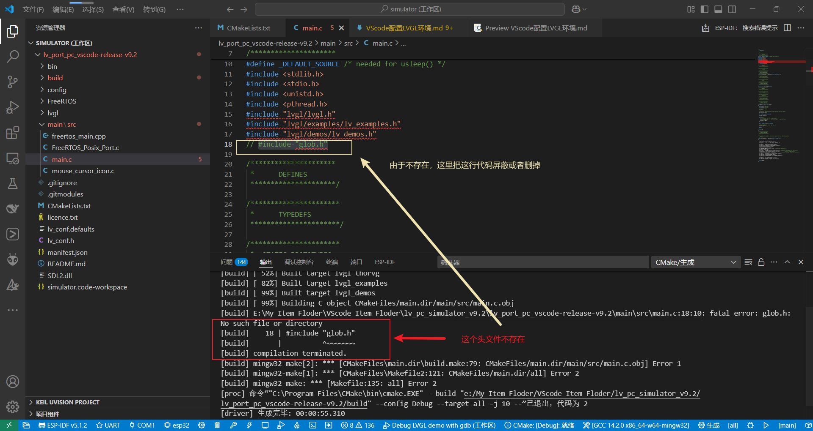
<br>
<br>

6. 编译后，会产生一个SDL_main未被定义的报错，导致无法运行代码，把main.c文件中的main()函数改为SDL_main()即可，然就再次编译
   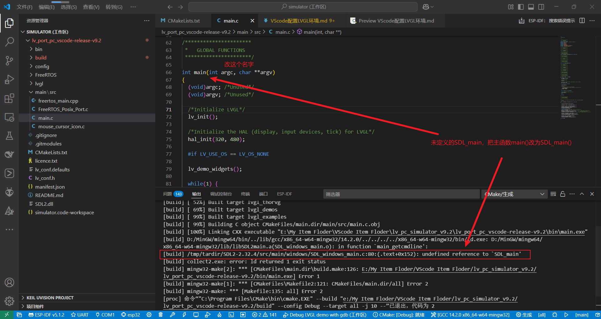
<br>
<br>


1. <span class="blue">如果产生以下报错，就是SDL2的版本不同导致的，使用不同的版本可能会产生下列报错。</span>如果产生，修改“D:\MinGW\mingw64\x86_64-w64-mingw32\lib\cmake\SDL2\sdl2-config.cmake”路径下的sdl2-config.cmake中的内容<span class="red">(实测如果使用的SDL2版本是 **SDL2-2.30.10**，就会产生这个报错，因为拷贝到mingw64文件中的cmake文件路径不对，这里VScode会自动弹出需要修改的.cmake文件，也可以事先自行修改。如果使用的SDL2版本是 **SDL2-2.32.4**就不会有这个报错。)</span>
  
  
<br>
<br>


6. 配置完成，编译验证
   
<br>
<br>
